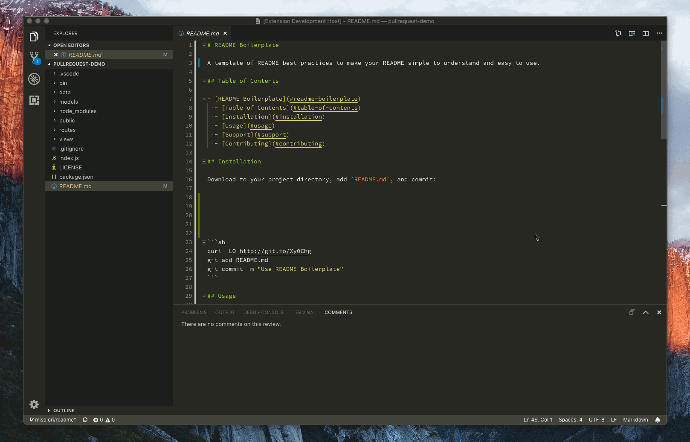

# Add Comments

KISS extension to add comments, copied 1:1 from [vscode-extension-samples](https://github.com/microsoft/vscode-extension-samples/tree/main/comment-sample)

## Motivation

I started using [vscode-security-notes](https://github.com/RefactorSecurity/vscode-security-notes) to be able to add comments while auditing code. However, given the small functionality needed, the sensitivity of code auditing and the overhead of keeping an eye on what the extension does with future updates I decided to have my own simple stupid extension that just adds comments. To my joy I realized that such extension already exists as sample in the [Microsoft repository](https://github.com/microsoft/vscode-extension-samples/tree/main/comment-sample).

## Installation

Download the vsix file. Then Extensions -> `...` icon -> Intall from VSIX...

Alternatively you can build it from source with the following:

`sudo apt install npm`

`npm install`

`sudo npm install -g @vscode/vsce`

`vsce package`
